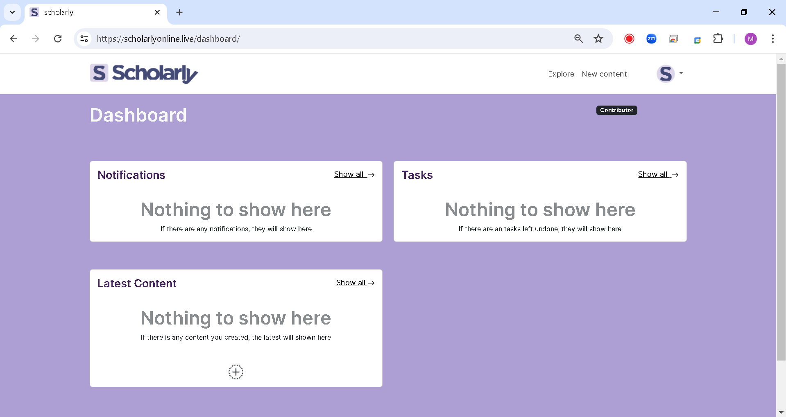
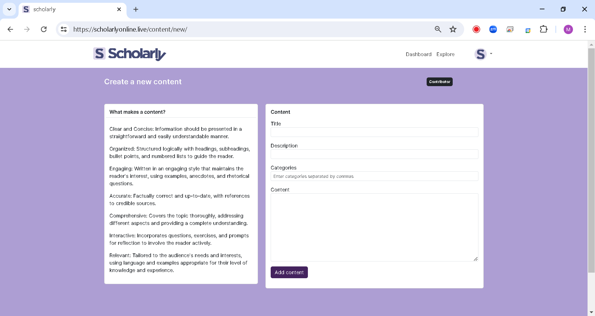
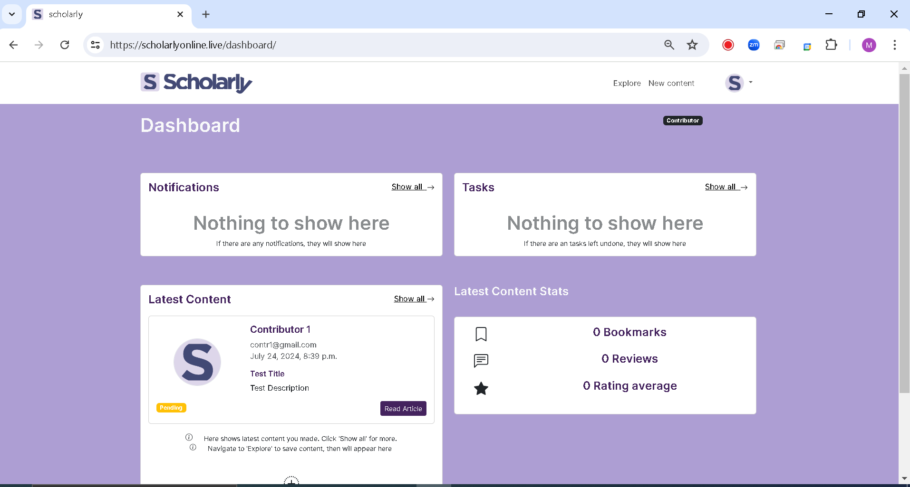
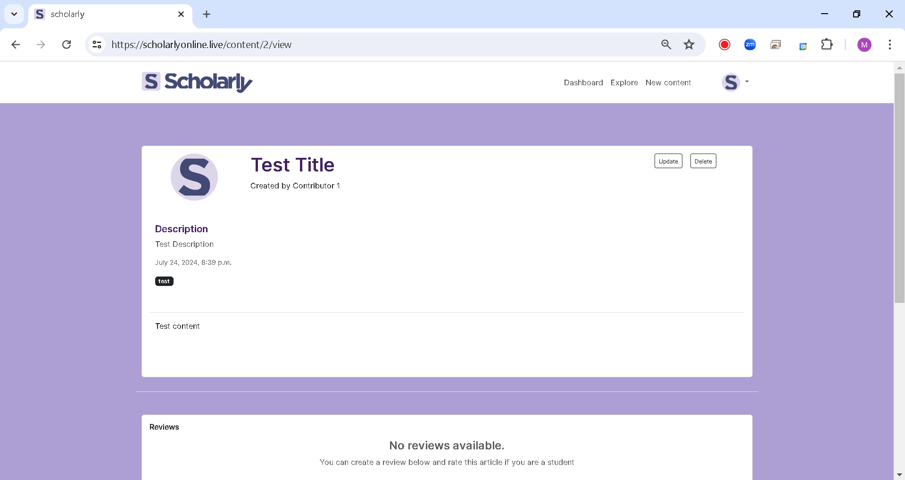
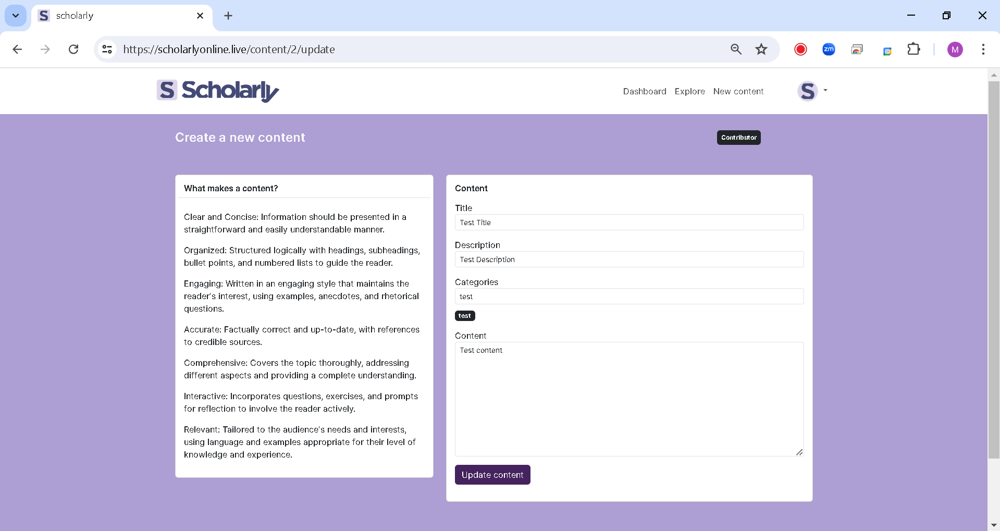

# Scholarly: Explore. Learn. Build

[](LICENSE)

<section style="text-align: center">
    
</section>

## Introduction

Scholarly is an educational resource blog web application developed with Django. It is a platform where students can explore and learn on various topics. Users can read on different topics, made by our commited contributors. The application is designed to be user-friendly and easy to navigate. It is a great tool for students and anyone who wants to learn something new.

### Author
**Mojalefa Kodisang** (Full stack software developer) <br>
Deployed website: https://scholarlyonline.live/ <br>
Blog post: https://www.linkedin.com/pulse/scholarly-educational-resource-blog-students-mojalefa-kodisang-5v7if/ <br>
LinkedIn: https://www.linkedin.com/in/mojalefa-kodisang-9751b71b2/ <br>


## Features

- **User authentication**: Users can sign up and log in to the application. We have three different users namely students, contributors, and moderators
- **User roles**: Users have different roles in the application. Students can read content, contributors can write content, and moderators can moderate content
- **Content**: Users can read content on various topics. Contributors can write content on various topics
- **Review**: Students can review the content by leaving a comment
- **Save**: Students can save content to read later
- **Moderation**: Moderators can approve or reject content
- **User profile**: Users can view their profile and update their information

## Installation

If ever you want to contribute to this project or application, you should follow these following instructions:

1. Clone the repository

    ```bash
    git clone https://{$YOUR_GIT_TOKEN}@github.com/mojalefakodisang/scholarly
    ```
2. Install a virtual environment
    
    ```bash
    sudo apt-get install -y virtualenv
    ```

3. Create a virtual environment

    ```bash
    cd scholarly # Change directory to scholarly
    virtualenv venv
    ```

4. Activate the virtual environment
    
    ```bash
    source venv/bin/activate
    ```

5. Install the dependencies

    ```bash
    pip install -r requirements.txt
    ```

6. Set the following environment variables

    ```bash
    export SCHOLARLY_EMAIL=email_you_want_to_use_for_development
    export EMAIL_PASSWORD=app_password # not email password
    export SECRET_KEY=your_secret_key # create a secret key
    export DB_ENGINE='django.db.backends.mysql'
    export DB_USER=your_db_username
    export DB_PASSWORD=your_user_db_password
    export DB_NAME=scholarly
    export DB_HOST=localhost
    export DB_PORT=3306
    ```

7. Create the database and user in MySQL 8.0
    
    ```sql
    CREATE DATABASE scholarly;
    CREATE USER 'your_db_username'@'localhost'IDENTIFIED BY 'your_user_db_password';
    GRANT ALL PRIVILEGES ON scholarly.* TO'your_db_username'@'localhost';
    FLUSH PRIVILEGES;
    ```

8. Run the migrations

    ```bash
    python3 -m manage makemigrations
    python3 -m manage migrate
    ```

9. Create a superuser

    ```bash
    python3 -m manage createsuperuser
    ```

10. You are all set. You now going to run the server

    ```bash
    python3 -m manage runserver
    ```

    Outcome:

    ```markdown
    Watching for file changes with StatReloader
    Performing system checks...

    System check identified no issues (0 silenced).
    August 25, 2024 - 12:00:00
    Django version 3.2.7, using settings 'scholarly.settings'
    Starting development server at http://127.0.0.1:8000/
    Quit the server with CONTROL-C.
    ```

11. Open your browser and navigate to `http://localhost:8000/` to view the application

    

12. You can now [log in](http://localhost:8000/login/) with the superuser credentials you created in step 9 or create a new one


## Usage

We have 3 different users namely Contributor, Student and Moderator. Each user has different roles in the application.

### Contributor

1. **Sign up**: Contributors can sign up by clicking on the [Get Started](https://scholarlyonline.live/login) button on the landing page. They will be redirected to the log in page, and click on [Contributor](https://scholarlyonline.live/contributor/register/) to sign up as a contributor
2. **Sign in**: After signing up, you will be redirected to log in page. After successfully logging in, you will be redirected to the dashboard of a contributor.
    
3. **Create Content**: Contributors can create content by clicking on the [Create Content](https://scholarlyonline.live/content/new/) button on the dashboard. They can write the title, description, categories and content of the article. After creating the content, they can submit it for moderation.
    
4. **Update Content**: Contributors can update their content by clicking on the [Update Content](https://scholarlyonline.live/content/update/) when they read their content. They can update the title, description, categories and content of the article. After updating the content, they can submit it for moderation.
    
    
    
    

    

## Related projects

- **Scholarly API** (Currently Private and in development): This is a related project that provides a RESTful API for the Scholarly web application. It allows developers to interact with the application programmatically, enabling them to build custom integrations or create their own front-end interfaces.

## Contributing

Contributions are welcome! Please follow the guidelines in [CONTRIBUTING.md](CONTRIBUTING.md).

## License

This project is licensed under the [MIT License](LICENSE).
